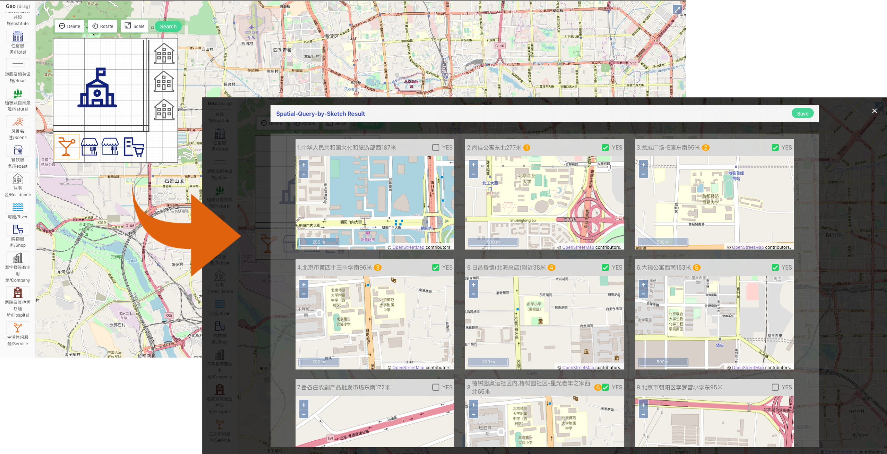

# Spatial-Query-by-Sketch

Spatial scene similarity, which has been widely investigated in spatial scene query and retrieval using images, measures the similarity between scenes in human spatial cognition and real geographic scenes. When querying about spatial scenes, a sketch map could be an intuitive tool to exploit human spatial knowledge, for the fact that users recall each spatial object according to an image-like representation in their minds, which is known as the mental map. However, the traditional sketch-based spatial search method has poor performance in recall rate due to its incapacity of finding hidden mental map features from sketches. In this article, we propose a novel Deep Spatial Scene Network (DeepSSN), which integrates a triplet-loss convolutional neural network, to better assess the spatial scene similarity. The triplet loss function is designed as a comprehensive distance metric to support the similarity assessment. Since the selection of triples is critical to the performance of our model, we develop a positive and negative exemplar mining strategy, which ensures a con- sistently increasing distinction of triplets during the training process. Moreover, we build a sketch-based spatial search system to automatically augment the training data for heavy spatial scene search tasks. The proposed model is validated using the OpenStreetMap map data in Beijing, China. The empirical results demonstrate that the DeepSSN outperforms native convolutional neural network methods and traditional machine learning methods in both recall rate and convergence time. The research offers insights into how image-based GIR research will progress with the emerging field of GeoAI.



### Model
The model part of the system. `distance_learning_spp.py`

The comparison of of our method and the other methods. `training_instance.ipynb`

### Backend
The backend part of the system.

The backend server of the system. `APP.py`

The online predict module of the system. `predict.py`

The online parse sketch module of the system. `parseSketch.py`

The bash script of backend. `start_back_end.sh`
```shell
./start_back_end.sh
```

### Openlayer
The frontend part of the system.

Install
```shell
npm install
```

Running
```shell
npm run dev
```

### Data

The training dataset and model param exceed GitHub's file size limit of 100.00 MB. Thus we upload to Baidu Yun Pan. Here is the [link](https://pan.baidu.com/s/1eUEfHLynoEja0_NLfyH14A).
